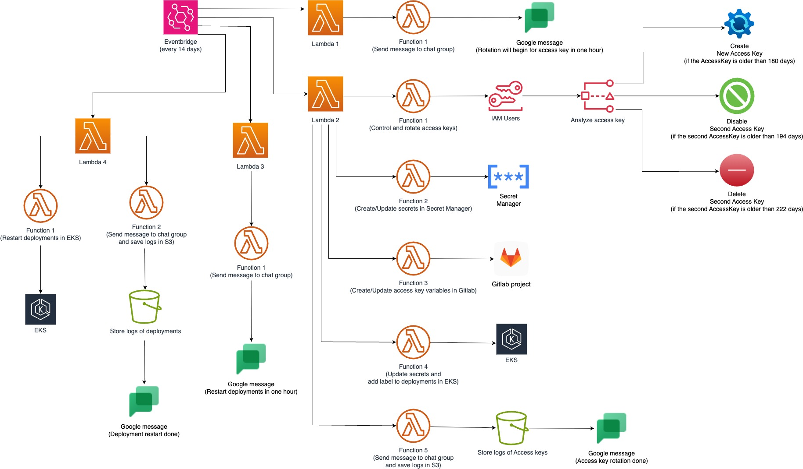

# AWS IAM Access Key Rotation and EKS Deployment Restart Automation

This project provides an automated system for rotating AWS IAM access keys, updating related secrets, and restarting affected EKS deployments.

## System Architecture

The system consists of 4 main Lambda functions:

1. **Pre-Rotation Notification Lambda** (`rotate_access_keys_send_message.py`):
   - Runs every 14 days
   - Announces which IAM users will have their keys rotated
   - Sends notifications via Google Chat

2. **Access Key Rotation Lambda** (`rotate_access_keys.py`):
   - Runs every 14 days
   - Rotates IAM keys (create/deactivate/delete)
   - Updates related secrets in AWS Secrets Manager
   - Updates GitLab CI/CD variables
   - Writes new keys to EKS secrets
   - Labels affected deployments

4. **Deployment Restart Notification Lambda** (`restart_k8s_deployments_send_message.py`):
   - Runs every 14 days
   - Announces which deployments will be restarted
   - Sends notifications via Google Chat

6. **Deployment Restart Lambda** (`restart_k8s_deployments.py`):
   - Runs every 14 days
   - Finds deployments with `accesskey-rotation=true` label
   - Restarts the identified deployments
   - Reports results to Google Chat
   - Stores logs in S3

## How It Works

1. **Rotation Rules**:
   - Create new keys for keys older than 180 days
   - Deactivate secondary keys older than 194 days
   - Delete inactive keys older than 222 days

2. **Integrations**:
   - New keys are stored in AWS Secrets Manager
   - GitLab CI/CD variables are updated
   - EKS secrets are updated and related deployments are labeled
   - Labeled deployments are restarted

## Requirements

1. **AWS Resources**:
   - IAM permissions (Access Key management)
   - Secrets Manager (Secret storage)
   - S3 Bucket (Log storage)
   - EKS Cluster (For running deployments)
   - Lambda functions
   - EventBridge (Scheduled triggers)

2. **Other Integrations**:
   - Google Chat Webhook URL
   - GitLab API Token
   - Kubernetes Service Account

## Installation

1. **Configuration Files**:
   - `iam_users.json`: List of IAM users for rotation
   - `iam_users_config.json`: User project and EKS configurations

2. **Lambda Environment Variables**:
   - `GOOGLE_CHAT_WEBHOOK_URL`: Notification webhook
   - `GITLAB_API_URL`: GitLab instance URL
   - `S3_LOG_BUCKET`: Log storage bucket

3. **EventBridge Rules**:
   - `rotate_access_keys_send_message`: Runs every 14 days on Tuesday
   - `rotate_access_keys`: Runs 1 hour after notification
   - `restart_k8s_deployments_send_message`: Runs after rotation completes
   - `restart_k8s_deployments`: Runs after restart notification

## Usage

The system is designed to run automatically. For manual execution:

1. First run the notification Lambdas
2. Then run the processing Lambdas

Logs are stored in S3 bucket organized by username and shared via 12-hour valid presigned URLs.
